# Level 1: System Context Diagram

## System Name: Ataraxis AI Navigator Assistant

## System Description
An AI-powered support agent that automates high-volume, repetitive navigator tasks including password resets, account access issues, FAQs, and routine inquiries. The system handles interactions via email and text channels while maintaining secure escalation paths to human navigators for complex issues. Additionally, the system provides an intelligent assistant interface for navigators to streamline their workflow by automatically gathering information from multiple systems and executing actions on their behalf.

## Key Business Goals
- [x] Reduce navigator workload by 30% through automation of routine queries
- [x] Improve employee experience with faster, more consistent responses
- [x] Enable navigators to focus on complex, sensitive, or compliance-heavy issues
- [x] Streamline navigator workflow with unified AI assistant interface
- [x] Establish scalable foundation for future workflow automation
- [x] Achieve 80% customer satisfaction score

## Users/Actors

### Internal Users
| User Type | Description | Key Interactions |
|-----------|-------------|------------------|
| Navigators | HR support specialists handling employee inquiries | Chat with AI assistant for help, review escalated tickets, provide feedback on AI responses, handle complex cases |
| HR Administrators | Manage HR operations and policies | Configure FAQ responses, review performance metrics, update knowledge base |
| System Administrators | IT staff managing the AI system | Monitor system health, manage integrations, handle technical issues |

### External Users
| User Type | Description | Key Interactions |
|-----------|-------------|------------------|
| Employees | Company employees seeking HR support | Submit inquiries via email/text/phone, receive automated responses, request escalation |
| New Hires | Employees in onboarding process | Ask questions about benefits, account access, onboarding steps |
| Managers | Team leaders with HR requests | Submit requests about team members, approve/review certain requests |

## External Systems

| System Name | Type | Purpose | Integration Method |
|------------|------|---------|-------------------|
| Pro HRIS | HR Information System | Employee data, login management, pay info, benefits | Web Scraping / Login Automation |
| CRM System | Customer Relationship Management | Client info, team assignments, "the bible" | API (TBD) |
| Podium | Text/Chat Platform | SMS communications, web chat, payment processing | API |
| Microsoft Exchange | Email Platform | Solutions inbox, voicemail attachments | API/SMTP |
| Microsoft Teams | Internal Communication | Warm transfers, escalations, internal messaging | API |
| Jira | Ticketing System | New hires, terminations, employee changes | REST API |
| RingCentral | Phone/Voicemail System | Voice calls, voicemail with transcription | API Integration |
| SSO Provider | Authentication Service | User authentication and authorization | SAML/OAuth (TBD) |

## System Boundaries

### In Scope

#### Core AI Capabilities
- [x] Natural language processing for chat-based interactions
- [x] Agentic framework with autonomous workflow execution
- [x] Multi-agent orchestration for complex tasks
- [x] Context-aware conversation management
- [x] Supervised learning from navigator feedback

#### Communication Channels
- [x] Text/SMS messaging via Podium API
- [x] Email handling through Microsoft Exchange
- [x] Internal team communication via Microsoft Teams
- [x] Voicemail transcription from RingCentral
- [x] Web-based chat interface

#### System Integrations
- [x] Pro HRIS data access (read-only via web scraping)
- [x] CRM system for team assignments
- [x] Jira ticket creation and routing
- [x] SSO authentication for secure access
- [x] Webhook support for real-time updates

#### Workflow Automation
- [x] FAQ response automation
- [x] Employee inquiry routing
- [x] Data lookup and retrieval
- [x] Notification management across channels
- [x] Escalation handling to navigators
- [x] Basic onboarding support workflows

#### User Interfaces
- [x] Navigator chat interface with session management
- [x] Admin dashboard for configuration and monitoring
- [x] Audit trail and feedback collection
- [x] Workflow visualization and management
- [x] SLA monitoring and alerts

### Out of Scope
- [x] Direct voice call handling
- [x] Pre-boarding workflow automation
- [x] Direct write access to Pro HRIS
- [x] Multi-language support (beyond English)
- [x] Complex benefits enrollment changes
- [x] Sensitive medical data handling
- [x] Direct payroll modifications
- [x] Performance review processes
- [x] Complex termination workflows
- [x] Real-time voice transcription

## Key Requirements

### Functional Requirements
- [x] Process 100-500 daily text messages
- [x] Handle email/ Podium text inquiries from Pro HRIS and CRM
- [x] Perform employee data lookups from Pro HRIS
- [x] Create Jira tickets with full context for escalations
- [x] Handel Transcribed Voicemails recieved by email
- [x] Provide context for text/email escalations via Teams
- [x] Support voice-based warm transfers between navigators and employees
- [x] Navigator assistant chat interface for streamlined operations
- [x] Single conversational interface for navigators to access all systems
- [x] Natural language queries to gather data from Pro HRIS, CRM, Jira
- [x] Automated cross-system data gathering for navigators
- [x] Execute actions (send messages, emails, create tickets) on navigator behalf
- [x] Eliminate need for navigators to manually switch between multiple systems
- [x] Enforce 2-hour response SLA for all messages (email, text, voicemail)
- [x] Monitor and escalate unanswered messages after 1.5 hours (warning) and 2 hours (escalation)
- [x] Support 2.5-minute hold limit for phone transfers (future phase)
- [x] Implement leadership escalation for non-responsive team members
- [x] Capture screenshots of text messages for Teams escalations
- [x] No cold transfers - always verify availability via Teams first
- [x] Audit dashboard for navigators to review AI decisions
- [x] Daily audit capability (minimum 5 random decisions)
- [x] Feedback mechanism to mark decisions as correct/incorrect/partial
- [x] Store corrections and context for continuous improvement
- [x] Search and review specific cases or employee interactions
- [x] Generate accuracy metrics and audit reports
- [x] Extract and parse historical communications (Podium, Email, Voicemail)
- [x] Build initial knowledge base from existing interaction patterns
- [x] Navigator validation interface for knowledge entries
- [x] Daily validation sessions for new patterns
- [x] Continuous learning from live navigator interactions
- [x] Automatic pattern recognition and clustering
- [x] Weekly knowledge base optimization and consolidation
- [x] Real-time capture of novel solutions
- [x] Confidence scoring and reinforcement learning
- [x] SME review queue for complex cases

### Non-Functional Requirements
- [x] Performance: Response time TBD (to be defined)
- [x] Security: Secure data handling, audit logging
- [x] Availability: Business hours minimum (24/7 for some channels TBD)
- [x] Scalability: Handle growth in inquiry volume
- [x] Satisfaction: Achieve 80% customer satisfaction score

## Constraints
- [x] Technical: Must integrate via web scraping for Pro HRIS (no API available)
- [x] Technical: Limited to existing infrastructure capabilities
- [x] Business: Cannot handle sensitive medical information
- [x] Business: English language only for Phase 1
- [x] Regulatory: Compliance requirements TBD
- [x] Resource: Navigator availability for feedback and validation

## Assumptions
- [x] Email integration will use Microsoft Outlook/Exchange (to be confirmed)
- [x] Pro HRIS access will be via web scraping rather than API
- [x] Historical ticket data will be made available for training (timeframe TBD)
- [x] Navigators will actively participate in feedback loops
- [x] Existing infrastructure can support AI workloads
- [x] Employees will adopt AI assistant for routine inquiries
- [x] Current FAQ documentation can be used as starting point

## Risks
| Risk | Impact | Likelihood | Mitigation |
|------|--------|------------|------------|
| Web scraping breaks due to Pro HRIS changes | High | Medium | Implement robust error handling, monitoring, quick fix procedures |
| Low employee adoption rate | High | Medium | Phased rollout, clear communication, demonstrate value early |
| AI provides incorrect information | High | Low | Extensive testing, conservative confidence thresholds, human review |
| Integration complexity higher than expected | Medium | Medium | Start with simple integrations, iterative development |
| Navigator resistance to AI assistance | Medium | Low | Include navigators in design, show workload reduction benefits |
| Compliance/security issues | High | Low | Security review, audit trails, clear data handling policies |
| Performance doesn't meet expectations | Medium | Medium | Set realistic goals, continuous optimization, regular monitoring |

## Estimated Effort for External Integrations

| Integration | Complexity | Estimated Hours | Notes |
|------------|------------|-----------------|-------|
| Pro HRIS Web Scraping | High | 120-160 | Complex due to scraping, multi-pod logic |
| CRM System | High | 80-120 | Critical for routing, team assignments |
| Podium | Medium | 60-80 | SMS and web chat platform |
| Microsoft Exchange | Medium | 40-60 | Solutions inbox, voicemail routing |
| Microsoft Teams | Medium | 40-60 | Internal escalation and warm transfers |
| Jira API | Medium | 40-60 | Ticket routing and assignment |
| RingCentral | Low | 20-30 | Voicemail transcription only |
| SSO Provider | Medium | 40-60 | Depends on provider (TBD) |

## Visual Diagram

```mermaid
graph TB
    %% Define styles
    classDef system fill:#1168bd,stroke:#0b4884,color:#fff,stroke-width:2px
    classDef internal fill:#08427b,stroke:#052e56,color:#fff,stroke-width:2px
    classDef external fill:#999999,stroke:#666666,color:#fff,stroke-width:2px
    classDef extSystem fill:#669966,stroke:#486648,color:#fff,stroke-width:2px
    
    %% Main System
    AI[AI Navigator Assistant<br/>━━━━━━━━━━━━━━━<br/>• FAQ Responses<br/>• Text/Email/Voice<br/>• Ticket Routing<br/>• Data Lookups<br/>• Escalation Mgmt]:::system
    
    %% Internal Users
    NAV[Navigators<br/>━━━━━━━━<br/>Chat with assistant<br/>Review escalations<br/>Provide feedback]:::internal
    HR[HR Administrators<br/>━━━━━━━━━━━━━<br/>Configure FAQs<br/>Review metrics]:::internal
    SYS[System Administrators<br/>━━━━━━━━━━━━━━━<br/>Monitor health<br/>Manage integrations]:::internal
    
    %% External Users
    EMP[Employees<br/>━━━━━━━━<br/>Submit inquiries<br/>Receive responses]:::external
    NEW[New Hires<br/>━━━━━━━━<br/>Onboarding questions<br/>Benefits inquiries]:::external
    MGR[Managers<br/>━━━━━━━<br/>Team requests<br/>Approvals]:::external
    
    %% External Systems
    PRO[Pro HRIS<br/>━━━━━━━<br/>Employee data<br/>Web scraping]:::extSystem
    CRM[CRM System<br/>━━━━━━━<br/>Team assignments<br/>The Bible]:::extSystem
    POD[Podium<br/>━━━━━━<br/>SMS/Text<br/>API]:::extSystem
    EX[Microsoft Exchange<br/>━━━━━━━━━━━━━<br/>Solutions inbox<br/>Voicemails]:::extSystem
    TEAMS[Microsoft Teams<br/>━━━━━━━━━━━<br/>Warm transfers<br/>Escalations]:::extSystem
    JIRA[Jira<br/>━━━━<br/>Ticket routing<br/>REST API]:::extSystem
    RC[RingCentral<br/>━━━━━━━━<br/>Voicemail only<br/>Transcription]:::extSystem
    SSO[SSO Provider<br/>━━━━━━━━━<br/>Authentication<br/>SAML/OAuth]:::extSystem
    
    %% User Interactions
    NAV <-->|Chat & request assistance| AI
    HR -->|Configures & monitors| AI
    SYS -->|Administers| AI
    EMP -->|Submits requests| AI
    NEW -->|Asks questions| AI
    MGR -->|Makes requests| AI
    
    %% System Integrations
    AI -->|Reads employee data| PRO
    AI -->|Gets team assignments| CRM
    AI <-->|Text messages| POD
    AI <-->|Email & voicemails| EX
    AI -->|Warm transfers| TEAMS
    AI -->|Creates/routes tickets| JIRA
    AI <-->|Voicemail transcripts| RC
    AI -->|Authenticates users| SSO
```

## Essential Workflow Sequence Diagrams

### 1. FAQ Email Response Workflow

### 2. Text Message Inquiry Workflow (Podium Text/Email)

### 3. Warm Transfer & Teams Escalation Workflow

### 4. Voicemail Processing Workflow

### 5. Employee Data Lookup Workflow (Pro → CRM Pattern)

### 6. Navigator Assistant Agent Workflow

### 7. Leadership Escalation Workflow

### 8. Response Time Monitoring Workflow

```mermaid
sequenceDiagram
    participant SYS as System Timer
    participant AI as AI Navigator Assistant
    participant DB as Message Database
    participant TEAMS as Microsoft Teams
    participant NAV as Navigator/Specialist
    
    loop Every 15 minutes
        SYS->>AI: Trigger message scan
        AI->>DB: Query unresponded messages
        DB-->>AI: Return pending messages with timestamps
        
        AI->>AI: Calculate time elapsed
        
        alt Message > 1.5 hours
            AI->>TEAMS: Send warning to assigned person
            TEAMS->>NAV: "Message approaching 2hr SLA"
            AI->>DB: Mark as warned
        else Message > 2 hours
            AI->>TEAMS: Send urgent alert
            TEAMS->>NAV: "🚨 SLA BREACH: Message > 2hrs"
            AI->>AI: Initiate leadership escalation
            AI->>DB: Mark as escalated
        else Message > 2.5 hours
            AI->>AI: Auto-escalate to lead
            AI->>DB: Log SLA violation
        end
    end
    
    Note over AI: Daily report generation
    AI->>AI: Compile SLA metrics
    AI->>TEAMS: Send daily performance report
```

### 9. AI Decision Audit Workflow

### 10. Knowledge Base Building Workflow (Initial & Continuous)

### 11. Continuous Learning Pipeline
