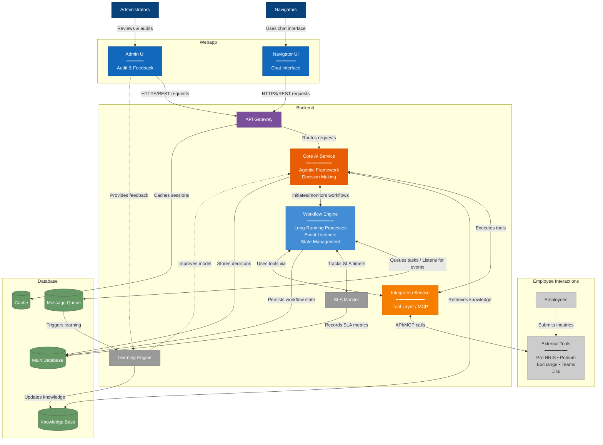

# Level 2: Container Diagram

## System: Ataraxis AI Navigator Assistant

## Container Inventory

### Web Applications

| Container Name | Purpose | Responsibilities |
|---------------|---------|------------------|
| Navigator UI | Navigator interface with chat | - Chat function to interact with AI agent - Execute everyday tasks using agent tools - Collect information via agent - Execute predefined workflows - Team member notifications |
| Admin UI | Administration and audit | - Review past interactions - Audit AI decisions - Provide feedback for learning - Pro HRIS authentication - View metrics and reports |

### Services/APIs

| Container Name | Type | Responsibilities |
|---------------|------|------------------|
| API Gateway | Gateway | - Route requests - Authentication - Rate limiting - Request validation |
| Core AI Service | Agentic Service | - Agentic framework for workflow execution - Execute workflows from Level 1 context - Access tools via Integration Service - Learning and knowledge base improvement - Decision making and routing |
| Integration Service | Tool Layer | - Standard communication to external tools - MCP integration where possible - Pro HRIS access - Podium, Exchange, Teams tools - Jira integration - Data transformation |
| Workflow Engine | Service | - Stateful process manager for long-running workflows - Event listeners for external triggers - Handles asynchronous multi-step processes - Manages workflows with back-and-forth interactions - Coordinates time delays and waiting periods - Tracks processes waiting on external systems/people - Handles uncertain completion paths - SLA timer management and escalations - Maintains workflow state across sessions - Reacts to system events (messages, timeouts, responses) |

### Data Stores

| Container Name | Type | Purpose |
|---------------|------|---------|
| Main Database | Database | Employee data cache, tickets, audit logs |
| Knowledge Base | Document Store | FAQ responses, patterns, templates |
| Message Queue | Queue | Async task processing |
| Cache Layer | Cache | Session data, temporary state |

### Background Workers

| Container Name | Purpose | Responsibilities |
|---------------|---------|------------------|
| Learning Engine | Continuous improvement | - Initialize KB from historical emails and Podium data - Process feedback from Admin UI - Update knowledge base - Pattern recognition - Model improvement - Incorporate navigator corrections |
| SLA Monitor | Compliance tracking | - Monitor response times for email, text, Teams - Track SLA compliance - Trigger escalations via Workflow Engine - Store SLA data for reporting |

## Container Interactions

| From Container | To Container | Purpose |
|---------------|--------------|---------|
| Navigator UI | API Gateway | Chat and workflow requests |
| Admin UI | API Gateway | Audit and feedback submissions |
| API Gateway | Core AI Service | Route requests to agent |
| Core AI Service | Integration Service | Execute tool actions |
| Core AI Service | Knowledge Base | Retrieve and update knowledge |
| Core AI Service | Workflow Engine | Complex workflow orchestration |
| Integration Service | Pro HRIS | Employee data access |
| Integration Service | Podium | Text messaging |
| Integration Service | Exchange | Email operations |
| Integration Service | Teams | Team communications |
| Integration Service | Jira | Ticket management |
| Workflow Engine | Message Queue | Async task processing |
| Learning Engine | Knowledge Base | Knowledge improvements |
| Learning Engine | Core AI Service | Model updates |
| SLA Monitor | Main Database | Compliance tracking |
| Admin UI | Learning Engine | Feedback for learning |

## Deployment Architecture

### Environments
| Environment | Purpose |
|------------|---------|
| Development | Development and testing |
| Staging | Pre-production validation |
| Production | Live system |

### Scaling Strategy
| Container | Min Instances | Max Instances | Scaling Trigger |
|-----------|---------------|---------------|-----------------|
| API Gateway | 2 | 10 | CPU > 70% |
| Core AI Service | 3 | 20 | Request queue depth |
| Integration Service | 2 | 10 | Request rate |
| Workflow Engine | 2 | 8 | Active workflows |
| SLA Monitor | 1 | 1 | Always running |
| Learning Engine | 1 | 3 | Feedback backlog |

## Security Considerations

### Authentication & Authorization
- [x] Single Sign-On integration
- [x] Multi-factor authentication for admin access
- [x] Role-based access control

### Network Security
- [x] Encrypted communication
- [x] API rate limiting
- [x] Network isolation
- [x] Secure secrets management

## Development Effort Estimation

### Container Development

| Container | Complexity | Estimated Hours | Team Size |
|-----------|-----------|-----------------|-----------|
| Navigator UI | High | 320 | 2 Frontend |
| Admin UI | Medium | 240 | 1 Frontend |
| API Gateway | Medium | 160 | 1 Backend |
| Core AI Service (Agentic) | Very High | 560 | 2 AI/Backend |
| Integration Service (MCP) | High | 400 | 2 Backend |
| Workflow Engine | High | 240 | 1 Backend |
| Learning Engine | Medium | 200 | 1 AI/Backend |
| SLA Monitor | Low | 80 | 1 Backend |

### Infrastructure Setup

| Task | Complexity | Estimated Hours |
|------|-----------|-----------------|
| Environment Setup | Medium | 80 |
| Container Orchestration | High | 120 |
| CI/CD Pipeline | Medium | 80 |
| Monitoring & Logging | Medium | 60 |
| Security Configuration | High | 100 |
| Load Testing | Medium | 60 |

## Visual Diagram

## Notes for Development Team

### Agentic Framework Architecture

The Core AI Service implements an agentic framework that:
- Executes workflows defined in the Level 1 context diagram
- Uses tools through the Integration Service layer
- Makes autonomous decisions within defined boundaries
- Learns from interactions and feedback
- Maintains context across complex multi-step workflows

### Workflow Engine Purpose

The Workflow Engine handles processes that cannot be completed in a single sequential session:
- **Event-Driven Architecture**: Listens for and reacts to system events (new messages, timeouts, external responses)
- **Asynchronous Processes**: Workflows requiring back-and-forth interactions over time
- **Time-Delayed Operations**: Processes with scheduled waits, follow-ups, or SLA timers
- **External Dependencies**: Workflows waiting on other systems or human responses
- **Uncertain Paths**: Processes that may succeed, fail, retry, or escalate unpredictably
- Examples: Password reset flows, warm transfers, voicemail processing with SLA tracking
- Event triggers: Incoming messages, timer expirations, system responses, human actions

### Integration Service & MCP

The Integration Service acts as a tool layer providing:
- **Model Context Protocol (MCP)** implementation where possible for standardized tool access
- Unified interface for all external system interactions
- Tool definitions for: Pro HRIS, Podium, Exchange, Teams, Jira
- Data transformation and error handling
- Retry logic and circuit breakers

### Risk Mitigation

- Design Integration Service with plugin architecture for easy tool additions
- Implement guardrails in Core AI Service for agent decision boundaries
- Create fallback mechanisms for when tools are unavailable
- Maintain human-in-the-loop capabilities via Navigator UI
- Build robust audit trail for all agent actions and decisions
