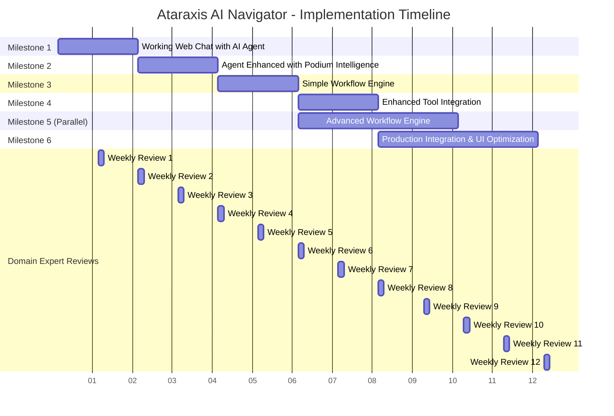

# Ataraxis AI Navigator - Implementation Milestones

## Strategy: Web Chat � Podium Intelligence � Workflow Engine

**Core Philosophy**: Quick feedback loops with tangible improvements at each milestone. Solve hard problems first while maintaining continuous domain expert validation.

## Milestone 1: Foundation Chat Interface (Weeks 1-2)

### Goal
Establish basic agent interaction with immediate visual feedback and domain expert testing capability.

### Deliverables
- **Navigator UI**: Minimal web chat interface with clean UX
- **Core AI Service**: Basic LLM integration with chat capabilities
- **API Gateway**: Simple authentication and request routing
- **Main Database**: Persistent storage for sessions, users, and audit logs
- **Cache Layer**: Session persistence for chat history
- **Security Framework**: Basic authentication, authorization, and data protection

### Key Features
- Real-time chat with AI agent
- Session management and history
- Basic error handling and user feedback
- Basic user authentication and session management

### Domain Expert Value
- Immediate hands-on experience with agent conversation flow
- Early feedback on AI personality and response style
- Test edge cases and conversation patterns

---

## Milestone 2: Data Intelligence (Weeks 3-5)

### Goal
Transform raw Podium data into actionable knowledge that enhances agent responses.

### Deliverables
- **Learning Engine**: Podium data extraction and processing pipeline
- **Knowledge Base**: Structured storage for patterns, FAQs, and templates
- **Enhanced Core AI Service**: Context-aware responses using Podium insights
- **Admin UI**: Basic interface for reviewing processed patterns and audit logs
- **Enhanced Database Schema**: Optimized storage for knowledge patterns and metadata

### Key Features
- Historical Podium message analysis
- Pattern recognition for common inquiries
- Template generation from successful responses
- Knowledge retrieval integrated into chat responses
- Admin dashboard for pattern validation and feedback
- Data privacy controls for sensitive information processing

### Domain Expert Value
- Agent demonstrates understanding of actual employee questions
- Responses reflect real organizational knowledge
- Ability to review and validate extracted patterns

---

## Milestone 3: Simple Workflow Engine (Weeks 4-6)

### Goal
Enable basic multi-step processes with simple linear workflows for common HR tasks.

### Deliverables
- **Simple Workflow Engine**: Sequential state management for linear processes
- **Basic Integration Service**: Core tool layer for HRIS, CRM and Podium access
- **Enhanced Navigator UI**: Basic workflow status and progress indicators
- **Message Queue**: Foundation for async task processing
- **Enhanced Database Schema**: Basic workflow state persistence

### Key Features
- Linear employee lookup → information gathering → response drafting workflow

- Simple workflow state persistence across sessions of answering basic HRIS information

- Simple cross-system data validation

### Domain Expert Value
- Agent can handle straightforward inquiry resolution processes with confirmation from Domain Expert
- Basic workflow progress visibility
- Foundation for SLA compliance tracking

---

## Milestone 4: Enhanced Tool Integration (Weeks 6-8)

### Goal
Expand basic tool capabilities and prepare foundation for advanced workflows while running in parallel with advanced workflow development.

### Deliverables
- **Enhanced Integration Service**: HRIS, Exchange, Teams connectivity
- **Extended Simple Workflow Engine**: Multi-channel communication workflows
- **Basic Admin UI**: Initial audit trail and feedback collection
- **SLA Monitor Foundation**: Basic compliance tracking
- **Infrastructure Setup**: Basic deployment and monitoring
- **Security Framework**: Core compliance controls

### Key Features
- Real-time HRIS data access
- Email integration capabilities
- Basic SLA timer integration for response tracking
- Basic escalation triggers
- Jira ticket creation and tracking integration
- Basic cross-platform workflow orchestration
- Initial audit logging
- Basic monitoring and alerting
- Core deployment pipeline
- Essential security controls

### Domain Expert Value
- Agent can access live employee data
- Basic multi-channel response capabilities
- Initial audit trail for compliance review
- Foundation for production deployment

---

## Milestone 5: Advanced Workflow Engine (Weeks 6-10) *[PARALLEL TRACK]*

### Goal
Implement sophisticated event-driven workflows with complex state management and advanced orchestration capabilities.

### Deliverables
- **Advanced Workflow Engine**: Event-driven, stateful process manager
- **SLE (Sophisticated Logic Engine)**: Complex decision-making and routing
- **Event Management System**: Advanced listeners and triggers
- **Workflow Orchestration Layer**: Multi-system coordination
- **Advanced State Management**: Complex workflow persistence

### Key Features
- Event-driven architecture with sophisticated listeners
- Complex multi-branch workflows with conditional logic
- Advanced SLA management with escalation chains
- Sophisticated error handling and retry mechanisms
- Dynamic workflow adaptation based on context
- Complex approval chains and delegation workflows
- Advanced notification and communication orchestration
- Workflow templates and dynamic generation

### Domain Expert Value
- Handles complex, non-linear business processes
- Sophisticated approval and escalation workflows
- Advanced SLA compliance with intelligent routing
- Dynamic workflow adaptation to business rules

---

## Milestone 6: Production Integration & UI Optimization (Weeks 8-12)

### Goal
Finalize production-ready system with optimized user interfaces, complete integrations, and enterprise-grade reliability.

### Deliverables
- **Complete Admin UI**: Comprehensive audit trail, feedback collection, and system monitoring
- **Optimized Navigator UI**: Advanced user experience and workflow visualization
- **Production Integration Service**: Full HRIS, Exchange, Teams connectivity
- **Advanced SLA Monitor**: Complete compliance tracking across all channels
- **Production Infrastructure**: Full deployment, monitoring, CI/CD pipeline
- **Security Hardening**: Complete compliance controls including PII/HIPAA protections
- **Performance Optimization**: Scaling controls and response optimization

### Key Features
- **Navigator UI Enhancements**:
  - Advanced workflow visualization and progress tracking
  - Intuitive user interface with guided interactions
  - Mobile-optimized responsive design for field use
  - Real-time status updates and notifications
  - Contextual help and training modules
  - Accessibility compliance (WCAG 2.1)

- **Admin UI Complete Implementation**:
  - Comprehensive audit trail with advanced filtering
  - Real-time system monitoring dashboard
  - User management and role-based access controls
  - Advanced reporting and analytics
  - Feedback collection and knowledge base management
  - System configuration and maintenance tools

- **Production System Features**:
  - Full cross-platform workflow orchestration
  - Enterprise-grade monitoring and alerting
  - Automated deployment and rollback capabilities
  - Complete compliance framework with data governance
  - Performance optimization and auto-scaling
  - Disaster recovery and backup systems

### Domain Expert Value
- Intuitive, production-ready interfaces for daily use
- Complete administrative oversight and control
- Full audit trail for compliance review
- Enterprise-grade reliability and performance
- Optimized user experience reduces training time
- Advanced reporting provides operational insights

---

## Container Coverage Matrix

### Complete Coverage Achieved
| Container | Milestone | Status |
|-----------|-----------|--------|
| Navigator UI | M1, M3, M6 | ✅ Complete (Basic → Enhanced → Optimized) |
| Admin UI | M2, M4, M6 | ✅ Complete (Basic → Initial → Complete) |
| API Gateway | M1 | ✅ Complete |
| Core AI Service | M1-M6 | ✅ Complete (Progressive enhancement) |
| Integration Service | M3-M6 | ✅ Complete (Basic → Enhanced → Production) |
| Simple Workflow Engine | M3-M4 | ✅ Complete |
| Advanced Workflow Engine | M5 | ✅ Complete (Parallel track) |
| SLE (Sophisticated Logic Engine) | M5 | ✅ Complete (Advanced workflows) |
| Main Database | M1-M6 | ✅ Complete (Progressive schema evolution) |
| Knowledge Base | M2 | ✅ Complete |
| Message Queue | M3 | ✅ Complete |
| Cache Layer | M1 | ✅ Complete |
| Learning Engine | M2 | ✅ Complete |
| SLA Monitor | M3-M6 | ✅ Complete (Basic → Advanced) |

### Additional Infrastructure
| Component | Milestone | Purpose |
|-----------|-----------|---------|
| Security Framework | M1, M4, M6 | Authentication, compliance, data protection |
| Infrastructure Setup | M4, M6 | Deployment, monitoring, CI/CD |
| Compliance Layer | M4, M6 | PII/HIPAA protections |
| Event Management System | M5 | Advanced workflow event handling |
| Performance Optimization | M6 | Scaling and response optimization |

---

## Implementation Notes

### Quick Wins Strategy
Each milestone delivers immediate value while building toward the complete system:
1. **Visual feedback** from day one with working chat interface
2. **Real knowledge** integration shows tangible intelligence
3. **Complete workflows** demonstrate end-to-end capability
4. **Production readiness** with full tool integration

### Domain Expert Engagement
- Weekly demo sessions with working features
- Rapid iteration cycles based on feedback
- Early identification of missing use cases
- Confidence building through incremental capability growth

### Technical Foundation
- Clean architecture enables rapid feature addition
- Modular design supports parallel development
- Comprehensive testing prevents regression
- Scalable infrastructure supports production deployment

---

## Implementation Timeline - Gantt Chart

### Timeline Overview
- **Total Duration**: 12 weeks (84 days)
- **Milestone Delivery**:
  - M1-M4: Every 2 weeks (sequential)
  - M5: Parallel track (4 weeks, overlapping with M4-M6)
  - M6: Final integration (4 weeks)
- **Domain Expert Reviews**: Weekly throughout
- **Testing Phases**: 3 days per milestone
- **Parallel Development**:
  - M4 and M5 run concurrently (weeks 6-10)
  - M5 advanced workflows integrate into M6
  - Components developed concurrently within milestones

### Parallel Development Strategy
- **Weeks 6-8**: M4 (Enhanced Tools) + M5 Start (Advanced Workflows)
- **Weeks 8-10**: M5 Completion (Advanced Workflows) + M6 Start (UI Optimization)
- **Weeks 10-12**: M6 Completion with M5 integration